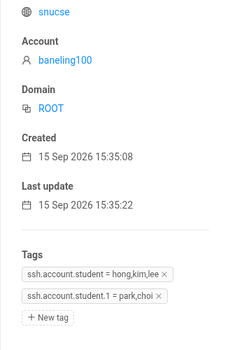

# 인스턴스에 접속하기

인스턴스는 외부에서 직접 닿을 수 없는 내부 주소를 받습니다. SSH는 접속 게이트웨이(cloud.snucse.org의 2222번 포트)를 거치고, 화면은 웹 UI의 콘솔로 봅니다.

## SSH

```console
$ ssh -p 2222 <SNUCSE ID 유저명>:<인스턴스 이름>@cloud.snucse.org
```

처음 접속하면 터미널에 로그인 링크가 나옵니다. 그 링크를 브라우저로 열어 SNUCSE ID로 로그인하면 접속이 이어집니다. **SSH 키를 만들어 등록할 필요가 없습니다.** 접속 게이트웨이가 SNUCSE ID로 본인을 확인하고 인스턴스에 대신 들어가므로, 어느 컴퓨터에서든 브라우저 로그인만으로 접속할 수 있습니다. 인스턴스 안에서는 템플릿의 기본 사용자로 들어가며, 접속 게이트웨이에서 오는 SSH는 인스턴스에 자동으로 허용되어 있습니다.

`~/.ssh/config`에 적어 두면 `scp`, `sftp`, VS Code Remote-SSH 등도 그대로 쓸 수 있습니다.

```
Host my-vm
    HostName cloud.snucse.org
    Port 2222
    User <SNUCSE ID 유저명>:my-vm
```

```console
$ ssh my-vm
$ scp data.tar.gz my-vm:
```

본인 계정의 인스턴스에 접속할 수 있습니다. 다른 사람의 인스턴스에는 그 소유자가 아래 방법으로 열어 준 계정으로만 들어갑니다.

## 다른 사람에게 접속 권한 주기 (게스트)

인스턴스의 소유자는 다른 SNUCSE ID 사용자를 **인스턴스 안의 특정 계정**으로만 들어오게 할 수 있습니다. 수업 실습 서버나 연구실 공용 서버에 학생·조교 계정을 나눠 줄 때 씁니다. 게스트는 인스턴스를 관리(정지·삭제·콘솔)할 수 없고 SSH만 됩니다.

1. 인스턴스 안에서 계정을 만듭니다. 예: `sudo adduser foo`
2. CloudStack UI에서 **Compute → Instances**에서 인스턴스를 열고, 왼쪽 정보 카드를 맨 아래로 내리면 **Tags**가 있습니다. **New tag**를 누르고 키 `ssh.account.<계정 이름>`, 값에 그 계정으로 들어올 SNUCSE ID 유저명을 쉼표로 나열한 뒤 체크 표시를 누릅니다.

   

   | Key | Value |
   | --- | --- |
   | `ssh.account.foo` | `alice,bob` |

   값 한 칸에는 255자까지 들어갑니다. 넘치면 같은 계정 이름 뒤에 `.1`, `.2`처럼 번호를 붙인 키를 더 만들어 이어서 적으면 하나로 합쳐집니다(`ssh.account.foo.1`, `ssh.account.foo.2`, …). 이름이 수십 개를 넘으면 [CLI로 한 번에 등록](course.md#cli로-한-번에-등록하기)하는 편이 편합니다.

3. 1분 안에 게스트가 접속할 수 있습니다. 게스트는 로그인 문자열 끝에 계정 이름을 붙입니다.

   ```console
   $ ssh -p 2222 <SNUCSE ID 유저명>:<인스턴스 이름>:<계정 이름>@cloud.snucse.org
   ```

태그를 지우거나 값에서 이름을 빼면 1분 안에 접속이 끊기고 막힙니다. 인스턴스 안 계정의 권한(sudo 등)은 소유자가 정하는 것이며, SNUCSE Cloud는 관여하지 않습니다.

게스트로 적을 사람은 **cloud.snucse.org에 한 번은 로그인한 적이 있어야** 합니다. 로그인 때 계정이 만들어지고, 그 계정이 있어야 태그의 이름이 효력을 가집니다. 수업이나 연구실 단위로 여러 사람에게 계정을 나눠 주는 절차는 [조교·관리자 가이드](course.md)에 있습니다.

접속 게이트웨이의 키는 인스턴스가 처음 부팅할 때 자동으로 들어갑니다(`/etc/ssh/warpgate_keys`, 모든 로컬 계정에 적용). 지우거나 sshd 설정을 바꾸면 접속이 끊기니 그대로 두세요.

## 웹 콘솔

**Compute → Instances**에서 인스턴스를 고르고 오른쪽 위의 **View console**(모니터 아이콘)을 누르면 새 창에 화면이 뜹니다. 부팅이 안 되거나 SSH가 막혔을 때 씁니다. 콘솔에서 로그인하려면 비밀번호가 필요하므로, 먼저 SSH로 들어가 `sudo passwd <사용자>`로 비밀번호를 정해 두세요.
