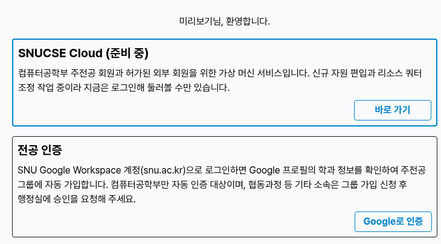
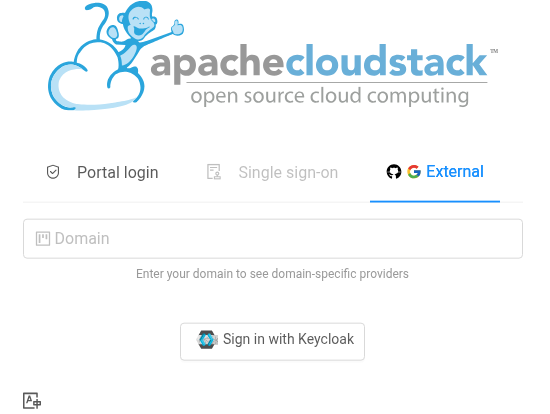

# 이용 대상과 로그인

## 이용 대상

- **컴퓨터공학부 주전공**: [SNUCSE ID](https://id.snucse.org)에서 **주전공 인증**을 마치면 "컴퓨터공학부 주전공" 그룹에 들어가고, 그 순간부터 SNUCSE Cloud에 로그인할 수 있습니다. 주전공 인증은 SNU Google Workspace(snu.ac.kr) 계정으로 학과를 확인하는 절차이며, SNUCSE ID 첫 화면에 있습니다.
- **허가된 외부 회원**: 주전공이 아니지만 사용이 필요하면 <contact@bacchus.snucse.org>로 문의해 주세요. 외부 회원을 위한 **게스트 그룹**을 SNUCSE ID에 신설할 예정이며, 그 그룹에 추가되면 같은 방법으로 로그인할 수 있습니다.

## 로그인

1. <https://cloud.snucse.org>에 접속합니다.
2. 아이디와 비밀번호 칸은 쓰지 않습니다. **External** 탭을 열고 **Sign in with Keycloak**을 누릅니다(Domain 칸은 비워 둡니다). 이 버튼이 SNUCSE ID로 연결됩니다.
3. SNUCSE ID에 로그인하고, 처음 한 번 뜨는 권한 요청을 승인합니다.

첫 로그인에서 계정이 자동으로 만들어집니다. 계정 이름은 SNUCSE ID 유저명과 같습니다.

"아직 사용할 수 없는 계정입니다"라는 화면이 나오면 아직 이용 대상 그룹에 없는 것입니다. 주전공 인증을 마친 뒤 다시 로그인해 주세요.

## 그룹에서 빠지면

이용 대상 그룹에서 빠지면(예: 졸업) 다음 로그인 때 계정이 비활성화됩니다. 인스턴스는 정지된 채 보존되고, 그룹에 다시 들어오면 계정도 다시 활성화됩니다. 계정과 인스턴스가 정리되는 기준은 정식 오픈 때 안내합니다.
