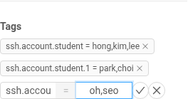
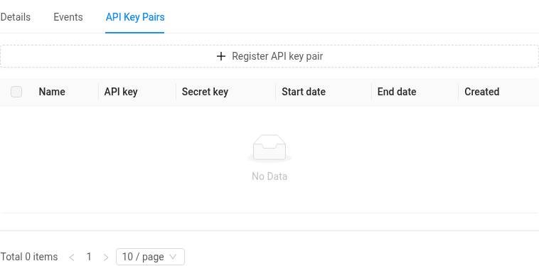
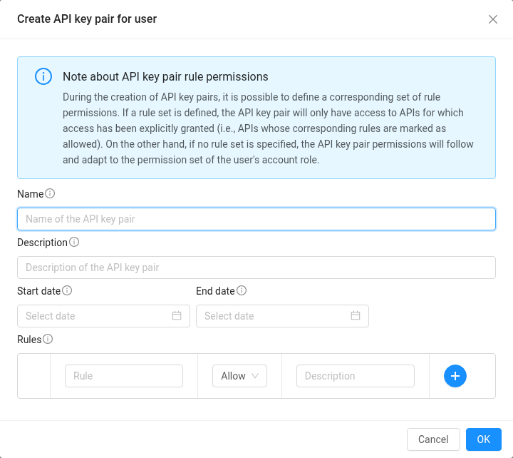

# 수업·연구실에서 쓰기 (조교·관리자 가이드)

한 사람이 인스턴스를 만들고 여러 사람이 그 안의 계정으로 접속하는 형태입니다. 수업 실습 서버, 연구실 공용 서버, 세미나용 GPU 서버가 여기에 해당합니다. 관리하는 사람(교수·조교·연구실 관리자)은 인스턴스를 만들고 지우는 **소유자**, 나머지(수강생·참여자)는 인스턴스 안의 계정으로만 들어오는 **게스트**입니다.

## 준비: 프로젝트와 쿼터

1. 관리자들끼리 [프로젝트](project.md)를 만듭니다. 프로젝트 구성원은 모두 인스턴스를 만들고 지우고 콘솔을 열 수 있는 공동 소유자이므로, 조교가 여럿이면 모두 구성원으로 넣으세요. 수강생은 구성원으로 넣지 않습니다.
2. 프로젝트 이름, 수업(또는 연구실) 이름, 필요한 자원(인스턴스 수, vCPU, 메모리, 디스크, GPU)과 기간을 적어 <contact@bacchus.snucse.org>로 [쿼터](quota.md)를 신청합니다.
3. 쿼터가 들어오면 프로젝트로 전환해 인스턴스를 만듭니다. 실습 서버 한 대에 학생별 계정을 만들어도 되고, 학생마다 인스턴스를 하나씩 만들어도 됩니다.

## 학생 등록

1. 학생들에게 **cloud.snucse.org에 한 번 로그인**하라고 안내하고 SNUCSE ID 유저명을 모읍니다. 로그인 전에는 계정이 없어서 아래 태그가 효력이 없습니다. SNUCSE ID가 없는 외부 참여자는 [이용 대상](account.md)을 참고하세요.
2. 인스턴스 안에서 계정을 만듭니다. 사람마다 하나씩(`sudo adduser hong`) 또는 공용 계정 하나(`sudo adduser student`). sudo를 줄지, 홈 디스크를 어떻게 나눌지는 관리자가 정합니다.
3. CloudStack UI에서 **Compute → Instances**에서 인스턴스를 열고, 왼쪽 정보 카드를 맨 아래로 내리면 **Tags**가 있습니다. **New tag**를 누르면 키와 값 칸이 나옵니다. 키는 `ssh.account.<계정 이름>`, 값은 그 계정으로 들어올 SNUCSE ID 유저명을 쉼표로(공백 없이) 나열하고 체크 표시를 누릅니다.

   

   | Key | Value | 뜻 |
   | --- | --- | --- |
   | `ssh.account.yun` | `yun` | yun은 자기 계정으로 |
   | `ssh.account.student` | `hong,kim,lee` | 세 명이 공용 계정 `student`로 |
   | `ssh.account.student.1` | `park,choi` | 같은 계정, 이어서 두 명 더 |

   값 한 칸에는 255자까지만 들어가므로(대략 SNUCSE ID 12~28개), 한 계정에 더 많은 사람을 넣으려면 같은 계정 이름 뒤에 `.1`, `.2`, … 번호를 붙인 키를 추가해 이어서 적습니다. 같은 키를 두 번 만들 수는 없습니다. 이름이 수십 명을 넘으면 아래 [CLI로 한 번에 등록하기](#cli로-한-번에-등록하기)를 쓰세요.
4. 학생에게 접속 문자열을 알려 줍니다. 처음 접속 때 브라우저 로그인이 한 번 필요합니다([접속하기](access.md)).

   ```console
   $ ssh -p 2222 <SNUCSE ID 유저명>:<인스턴스 이름>:<계정 이름>@cloud.snucse.org
   ```

태그를 넣고 1분 안에 접속이 됩니다. 학생은 인스턴스를 정지·삭제하거나 콘솔을 열 수 없고, 태그에 적힌 계정으로 SSH만 됩니다.

## CLI로 한 번에 등록하기

수강생이 수백 명이면 태그를 손으로 넣기 어렵습니다. CloudStack API를 쓰는 공식 CLI [cloudmonkey](https://github.com/apache/cloudstack-cloudmonkey/releases)(`cmk`)로 한 번에 넣을 수 있습니다.

### API 키 만들기

오른쪽 위의 본인 이름 → **Profile** → **API Key Pairs** 탭 → **Register API key pair**. 이름만 적고 OK를 누르면 표에 API key와 Secret key가 나타납니다. 둘 다 비밀번호처럼 다루세요. 이 키로는 본인 계정과 소속 프로젝트의 자원을 API로 다룰 수 있습니다.





### cmk 설정

```console
$ cmk set profile snucse
$ cmk set url https://cloud.snucse.org/client/api
$ cmk set apikey <API key>
$ cmk set secretkey <Secret key>
$ cmk sync
```

인스턴스 ID를 찾습니다. 프로젝트 인스턴스는 프로젝트 ID를 함께 줘야 보입니다.

```console
$ cmk list projects filter=id,name
$ cmk list virtualmachines projectid=<프로젝트 ID> filter=id,name
```

### 태그 넣기와 빼기

키에 대괄호가 들어가므로 따옴표로 감쌉니다.

```console
$ cmk create tags resourceids=<인스턴스 ID> resourcetype=UserVm \
    'tags[0].key=ssh.account.student' 'tags[0].value=kim,lee,park'
$ cmk delete tags resourceids=<인스턴스 ID> resourcetype=UserVm \
    'tags[0].key=ssh.account.student' 'tags[1].key=ssh.account.student.1'
```

SNUCSE ID를 한 줄에 하나씩 적은 파일(`ids.txt`)이 있으면, 아래 스크립트(bash)가 255자 단위로 `ssh.account.student`, `ssh.account.student.1`, `.2`…로 나눠 한 번에 넣습니다. 300명이면 태그 16개 정도가 됩니다.

```bash
#!/bin/bash
set -f   # 대괄호가 파일 이름 패턴으로 풀리지 않게
VM=<인스턴스 ID>; ACCOUNT=student
n=0; args=""; chunk=""
while read -r id; do
  [ -z "$id" ] && continue
  if [ $(( ${#chunk} + ${#id} + 1 )) -gt 255 ]; then
    key=$ACCOUNT; [ $n -gt 0 ] && key="$ACCOUNT.$n"
    args="$args tags[$n].key=ssh.account.$key tags[$n].value=$chunk"; n=$((n+1)); chunk=""
  fi
  chunk="${chunk:+$chunk,}$id"
done < ids.txt
key=$ACCOUNT; [ $n -gt 0 ] && key="$ACCOUNT.$n"
args="$args tags[$n].key=ssh.account.$key tags[$n].value=$chunk"
cmk create tags resourceids=$VM resourcetype=UserVm $args
```

이미 같은 키가 있으면 오류가 나므로, 명단을 바꿀 때는 먼저 `cmk delete tags`로 지우고 다시 넣습니다. 태그가 반영되면 1분 안에 접속이 열립니다.

## 학기가 끝나면

- 태그를 지우면 1분 안에 접속이 끊기고 막힙니다. 인스턴스 안 계정과 파일은 남습니다.
- 인스턴스를 지우면 쿼터가 돌아옵니다. 필요한 데이터는 미리 받아 두세요.
- 다음 학기에 같은 프로젝트를 쓰려면 쿼터 기간 연장을 신청하세요.
