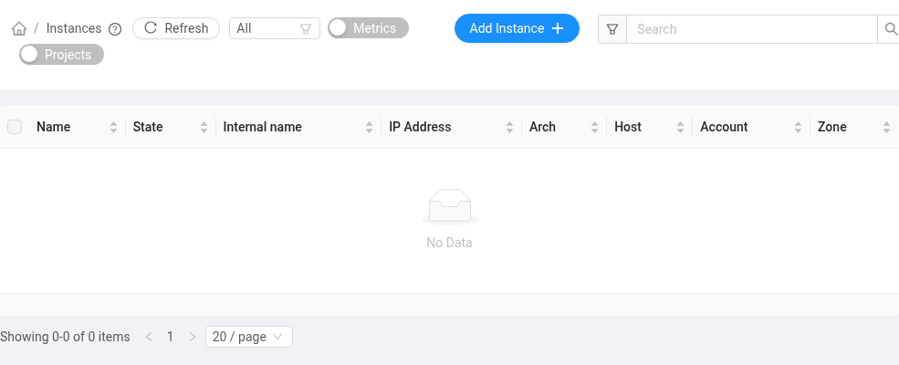

# 인스턴스 만들기

왼쪽 메뉴의 **Compute → Instances**에서 **Add Instance**를 누릅니다.

순서대로 템플릿(운영체제), 컴퓨트 오퍼링(CPU·메모리·GPU), 데이터 디스크(선택), 이름을 고르면 됩니다. 네트워크는 하나뿐이라 자동으로 선택됩니다.

**제공할 템플릿과 컴퓨트 오퍼링은 정식 오픈 때 정해서 공지합니다.** 지금 화면에 보이는 것은 시험용입니다.

- 이름은 영문 소문자·숫자·하이픈만 쓰세요. SSH 접속 때 이 이름을 씁니다.
- 만들어진 인스턴스는 목록에서 정지·시작·재시작·삭제할 수 있습니다. 컴퓨트 오퍼링 변경은 정지 상태에서만 됩니다.
- 삭제한 인스턴스와 볼륨은 복구되지 않으니 필요한 데이터는 미리 옮겨 두세요.
- 정지된 인스턴스도 볼륨과 쿼터를 그대로 차지합니다. 쓰지 않으면 삭제해 주세요.
