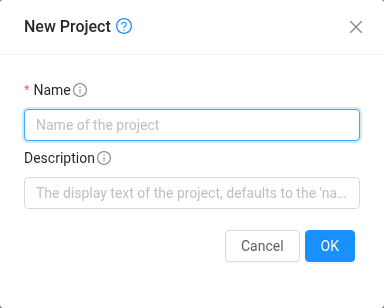

# 프로젝트 (협업)

여러 사람이 인스턴스를 함께 쓰거나 리소스 쿼터를 공유하려면 **프로젝트**를 만드세요. 프로젝트 안에서 만든 인스턴스와 볼륨은 개인이 아니라 프로젝트 소유이고, 구성원 모두가 관리하고 SSH로 접속할 수 있습니다. 프로젝트는 개인 쿼터와 별개인 **자체 리소스 쿼터**를 가지므로, 연구실이나 팀 단위로 쿼터를 받아 나눠 쓰는 데 알맞습니다.

- **만들기**: 왼쪽 메뉴의 **Projects → New Project**. 이름만 적으면 되고, 만든 사람이 프로젝트 관리자가 됩니다.

  
- **구성원 추가**: 프로젝트의 **Accounts** 탭에서 상대의 계정 이름(SNUCSE ID 유저명)을 추가합니다. 역할은 Admin(구성원 관리 가능)과 Regular(자원 사용) 중 고릅니다. 초대 승인 절차 없이 바로 들어갑니다.
- **전환**: 화면 위쪽의 프로젝트 선택에서 프로젝트를 고르면 그 프로젝트의 자원이 보입니다. 기본 보기는 개인 계정입니다.
- **쿼터**: 새 프로젝트의 쿼터는 0으로 시작합니다. 프로젝트 이름과 필요한 양을 적어 <contact@bacchus.snucse.org>로 신청하세요.
- **SSH**: 접속 방법은 개인 인스턴스와 같습니다. 구성원은 모두 인스턴스의 같은 기본 사용자로 들어가므로, 사람마다 계정이 필요하면 인스턴스 안에서 만드세요.
